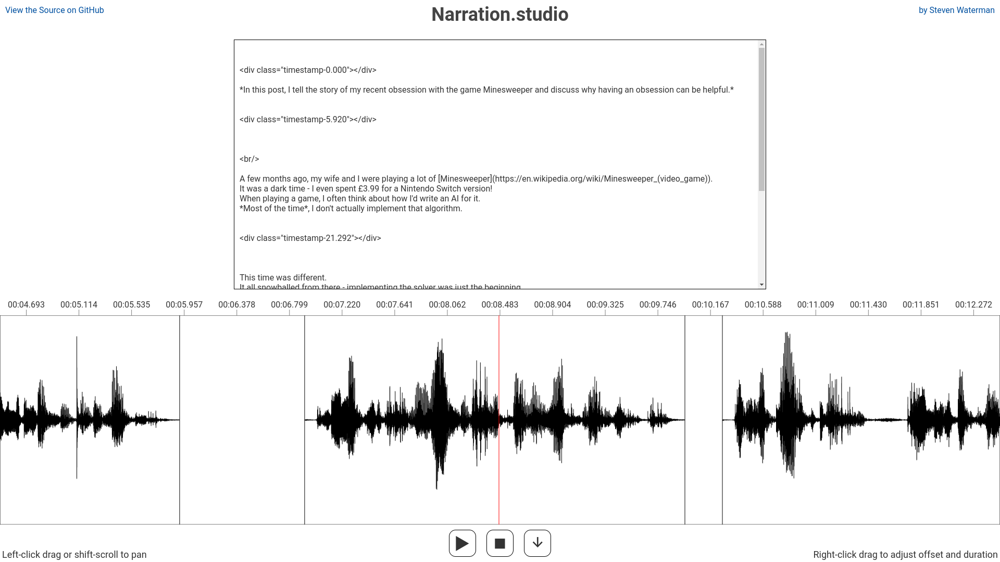

# [Narration.studio](https://narration.studio)

Narration Studio is an in-browser audio editing tool for recording voiceovers and audio books.

* **Automatic** - Speech recognition API detects the start and end of each sentence, allowing you to pause, talk about other things, and retake previous lines.
* **Batteries-Included** - Supports plaintext, CommonMark, and GFM. No setup, no accounts, completely in-browser.
* **High Performance** - Rendering using WebGL, editing using Web Audio API, lossless WAV audio throughout. Instant auto-save using IndexedDB.

## Contributing

This project is completely open-source, and any contributions are welcome.
Feel free to open issues with feedback and suggestions, fork and make it your own, or submit a PR to fix something that annoys you.

### License

Narration.studio is [MIT licensed](./LICENSE).

## Implementation

This is a brief description of a few implementation details - mostly just the interesting bits!

### Script Parsing

Uses the lexer from [marked](https://www.npmjs.com/package/marked) for script parsing, before performing a series of post-processing steps.
The end result is that the script is converted to a series of tokens, each eiter `PARAGRAPH`, `PAUSE`, or `TEXT`.

`PARAGRAPH` and `PAUSE` tokens correspond with a period of silence in the final audio.
Timestamps are added to the script before each `PARAGRAPH` token, to indicate at what time that paragraph should be highlighted.
The `PARAGRAPH` tokens also contain the raw markdown for that paragraph.

The `TEXT` tokens are what the user will have to speak.

### Recording

Narration Studio uses the [Web Speech Recognition API](https://developer.mozilla.org/en-US/docs/Web/API/SpeechRecognition) to detect what the user said.
It is compared with the current line and previous line in the script.

The recognised speech and the two line options are replaced with their pronunciation according to the [CMU pronouncing dictionary](http://www.speech.cs.cmu.edu/cgi-bin/cmudict).
Each phoneme is mapped to a single character, meaning we end up with three mostly gibberish strings.

We then compute the [Levenshtein distance](https://en.wikipedia.org/wiki/Levenshtein_distance) from the recognised speech to the current line and previous line.
We divide that distance by the length of the string to get a relative error value.
We calculate upper and lower bounds of that based on the confidence value returned by the speech recognition api.

If the two confidence intervals don't overlap then we accept the closest option, assuming it is under a threshold value.

Audio is constantly recorded during this stage using the [Media Devices API](https://developer.mozilla.org/en-US/docs/Web/API/MediaDevices).

### Processing

Once recording is complete, we have the recording from the entire time spent on that page and the start/end speech timestamps.
This stage has two goals:

* Post-process the audio
* Find exact speech start/end times

To post-process the audio, we calculate the maximum volume and run it through a gain filter.
The resulting peak volume is 80% of the max system volume.
We also run it through a low shelf filter which removes all audio under 10Hz.
This is inaudible to humans, but messes up the volume calculations in the next step, and makes the waveform look wobbly.

To find the start and end of the speech, we first calculate a volume envelope.
To do that, we run the audio through a series of filters:

1. Bandpass filter, keeping the 300-3000Hz range which represents human speech
1. Absolute filter, which calls `Math.abs()` on each sample
1. Mean filter, which takes chunks of 128 samples and sets them to their mean volume

This gives an approximation of how loud the speech is at any moment.
We take the approximate start and end times from the speech recognition api and perform the following series of adjustments:

1. Expand outwards 0.5 seconds
1. Expand outwards until you hit silence
1. Contract inwards until you hit speech
1. Expand outwards until you hit silence

Here, silence is defined as 0.1 seconds of audio with a volume under 3%.
Speech is defined as audio with a volume over 20%.
The percentages are relative to the peak volume in the original estimated range.

This tends to work pretty well.

### Editing

The waveform is rendered using WebGL2 in an OffscreenCanvas.
UI elements are drawn on top of that using the DOM.